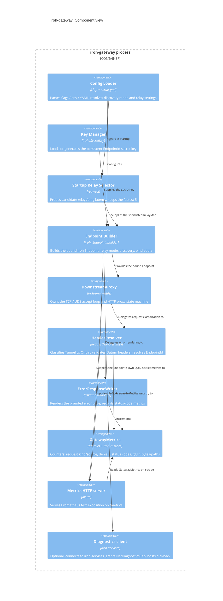

# Component view

Inside the single binary. Almost everything is wiring around two crates:
[`iroh`](https://docs.rs/iroh) (the endpoint, discovery, and relay machinery)
and [`iroh-proxy-utils`](https://docs.rs/iroh-proxy-utils) (the HTTP proxy
state machine). `iroh-gateway`'s own code is the config, key handling, header
policy, and metrics glue around them.

`HeaderResolver` and `ErrorResponseWriter` are the only two pieces of
routing-specific policy in the whole process. Everything on either side of
them is generic iroh/proxy plumbing, so most behavioral changes to *what*
gets proxied and *how it's validated* live in `src/gateway.rs`
(`HeaderResolver::handle_request`), not in `src/endpoint.rs`.

The relay probe (`select_best_relays_for_startup`) only runs when the
configured relay list exceeds five URLs, and only at startup. It is not
re-evaluated while the process is running, so a relay that degrades
mid-uptime isn't dropped from the shortlist until restart.

`/metrics` is an aggregation point, not just a counter dump: each scrape
merges `iroh-gateway`'s own `GatewayMetrics`, the iroh `Endpoint`'s built-in
QUIC/socket counters, and `DownstreamProxy`'s `DownstreamMetrics` registry
into one response.
