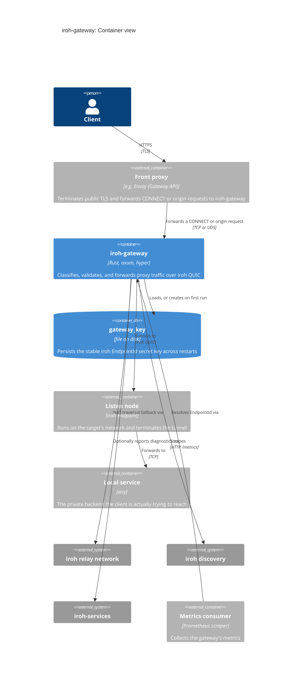

# Container view

`iroh-gateway` is a single binary, but it's rarely deployed alone: something
has to terminate public TLS and hand it traffic, and something on the other
side has to be listening on the target `EndpointId`.

## Deployment notes

- **Identity is disk-persisted.** `gateway_key` is generated once and read on
  every subsequent start; losing or rotating that file changes the gateway's
  iroh identity. Mount it on a path that survives restarts.
- **UDS is a common front-proxy transport.** Pairing `iroh-gateway` with a
  TLS-terminating front proxy over a Unix domain socket, rather than a pod- or
  host-network TCP hop, keeps the proxy hop off the network and out of scope
  for network-level ACLs. Datum Connect's own deployment does this.
- **The trust boundary is external.** `iroh-gateway` does not authenticate
  `x-iroh-endpoint-id`, `x-datum-target-host`, or `x-datum-target-port` itself
  (see [../README.md](./README.md#trust-model)). Whatever fronts it, and
  whatever network policy controls reachability of its listener(s), *is* the
  access-control layer.
- **`--discovery hybrid`** is useful when migrating between discovery
  backends (e.g. a custom DNS origin) without breaking clients that only
  publish to the default (n0des) discovery.
