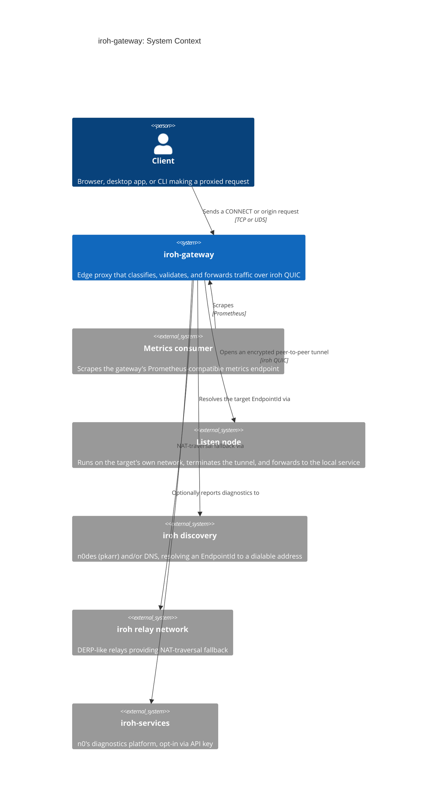

# System context

Who talks to `iroh-gateway`, and what it depends on to get a tunnel open.

Discovery and relay are consulted on every cold dial to a new `EndpointId`;
once a direct QUIC path is up, the gateway holds it and skips both.
