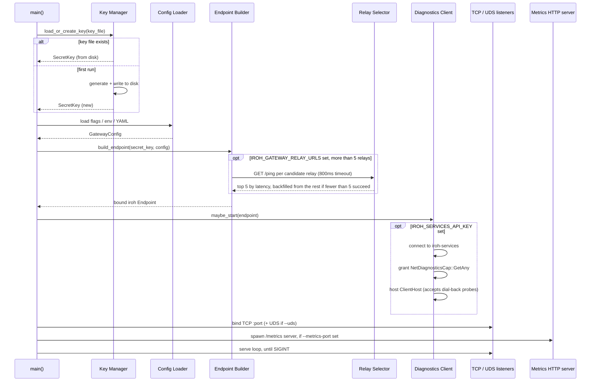
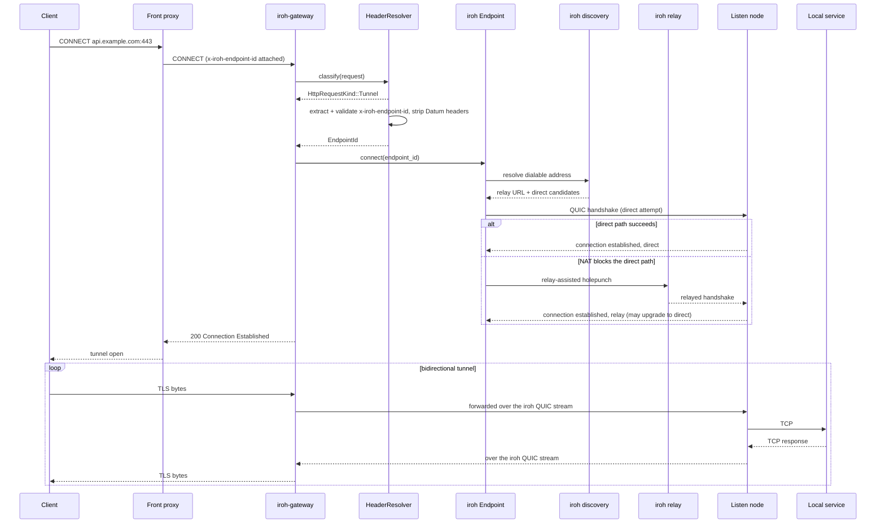
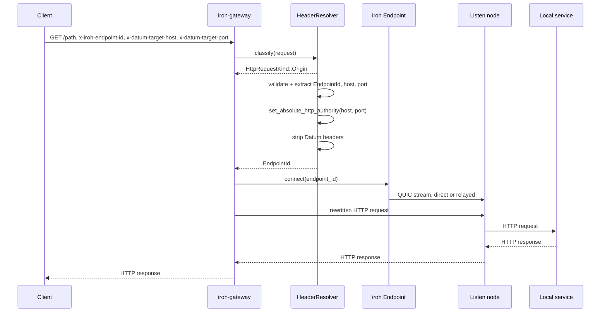
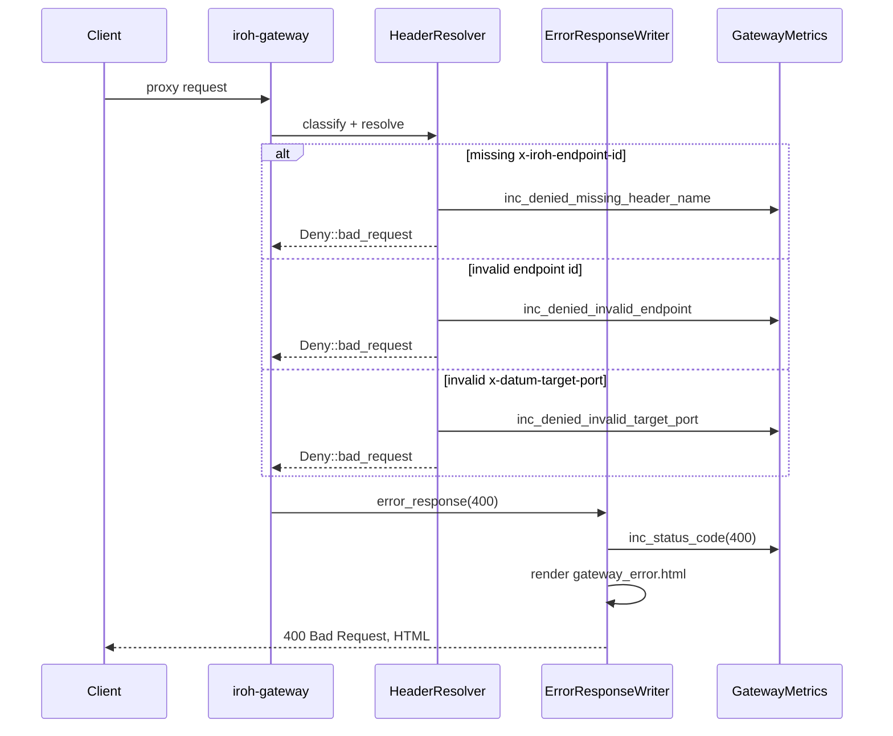

# Sequence diagrams

## Startup & endpoint bootstrap

Boot order matters: the endpoint identity and relay shortlist are settled
before either listener opens.

## CONNECT tunnel mode

The dominant path: a `CONNECT`, upgraded to a raw byte tunnel. This is how
HTTPS and arbitrary TCP get through.

Once a stream to that `EndpointId` exists, later requests skip discovery and
the relay entirely. The metrics use `has_existing_peer_conn` to tell a fresh
dial from a reused one.

## Header-routed origin proxy

The header-routed path: a plain HTTP request naming its target explicitly,
rewritten and forwarded rather than tunneled raw.

All three Datum headers are stripped before the request leaves the gateway.
The listen node and the local service never see gateway-internal routing
details.

## Validation failure & error response

Every deny path funnels through the same templated error page, tagged with
why.

5xx responses are also tagged by whether a peer connection already existed,
via `iroh_gateway_upstream_failures_total{peer_conn_state=…}`, so a spike
right after a fresh dial reads differently from one on an established
tunnel.
